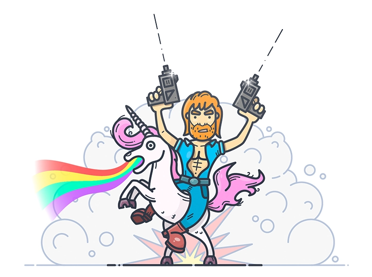

<a name="readme-top"></a>

[![LinkedIn][linkedin-shield]][linkedin-url]


<!-- PROJECT LOGO -->
<br />
<div align="center">
  <a href="https://github.com/rscarlosjunior/chuck-jokes">
    
  </a>

  <h3 align="center">Best search about Chuck Norris FACTS(not jokes) </h3>

  <p align="center">
    An awesome project to search the best facts about Chuck Norris.
    <br />
    <a href="https://github.com/rscarlosjunior/chuck-jokes"><strong>Explore the repository »</strong></a>
    <br />
    <br />
    <a href="https://chuck-jokes-mauve.vercel.app/">View Demo</a>
    ·
    <a href="https://www.linkedin.com/in/carlos-silva-13612464/">Report Bug</a>
    ·
    <a href="https://github.com/rscarlosjunior/chuck-jokes/issues">Request Feature</a>
  </p>
</div>


<!-- ABOUT THE PROJECT -->
## About The Project

Awesome jokes facts about Chuck Norris with unicorns.

Here's why:
* I needed one new project
* You probably like unicorns
* I wanted to show to anyone the best experiencia with a joke API :smile:

Of course, it's not a finished project and it always can be more awesome doing upgrades.

### Built With
* [![Vue][Vue.js]][Vue-url]
* [![Typescript][Typescript]][Typescript-url]


<!-- GETTING STARTED -->
## Getting Started

Please follow the doc to start

### Prerequisites
  ```sh
node ^v16.15.1
 ```

This is an example of how to list things you need to use the software and how to install them.
* npm
  ```sh
  npm install npm@latest -g
  ```

### Installation

1. We gonna use the free api :  [https://api.chucknorris.io/](https://api.chucknorris.io/)
2. Clone the repo
   ```sh
   git clone https://github.com/rscarlosjunior/chuck-jokes.git
   ```
3. Install NPM packages
   ```sh
   npm install
   ```
4. Compile and Hot-Reload for Development
   ```js
   npm run dev
   ```
5. Type-Check, Compile and Minify for Production
   ```js
   npm run build
   ```
6. Run Unit Tests with [Vitest](https://vitest.dev/)
   ```js
   npm run test:unit
   ```
<p align="right">(<a href="#readme-top">back to top</a>)</p>

## Usage


https://user-images.githubusercontent.com/75792848/189529645-0117693f-04ff-429b-9005-c9b8b5879280.mp4


<p align="right">(<a href="#readme-top">back to top</a>)</p>

<!-- CONTACT -->
## Contact

Carlos Silva - [Linkedin](https://www.linkedin.com/in/carlos-silva-13612464/) - rs.carlosjunior@gmail.com

Project website demo link: [ChuckNorris Facts](https://chuck-jokes-mauve.vercel.app/)

<p align="right">(<a href="#readme-top">back to top</a>)</p>


<!-- MARKDOWN LINKS & IMAGES -->
<!-- https://www.markdownguide.org/basic-syntax/#reference-style-links -->
[linkedin-shield]: https://img.shields.io/badge/-LinkedIn-black.svg?style=for-the-badge&logo=linkedin&colorB=555
[linkedin-url]: https://www.linkedin.com/in/carlos-silva-13612464/
[product-screenshot]: src/assets/images/chuck.png
[Vue.js]: https://img.shields.io/badge/Vue.js-35495E?style=for-the-badge&logo=vuedotjs&logoColor=4FC08D
[Vue-url]: https://vuejs.org/
[Typescript-url]: https://www.typescriptlang.org/
[Typescript]: https://badges.frapsoft.com/typescript/code/typescript.png?v=101"
